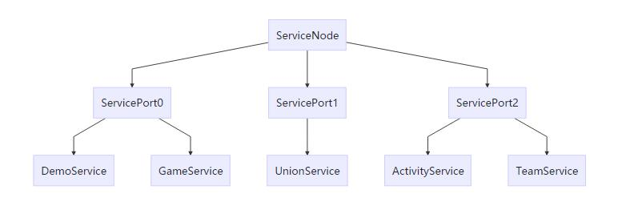

## 基础概念介绍
- ServiceNode: 服务节点，对应进程，每个进程对应一个ServiceNode。一个ServiceNode下面可以挂载或管理若干个ServicePort。
- ServicePort: 服务线程节点，对应线程，每个线程对应一个ServicePort。一个ServicePort下面可以挂载或管理若干个Service。
- Service: 具体的服务，服务的最基本单元。RPC通信的基本单元，所有服务之间的通信调用，都是调用的对应服务的RPC函数。


## ServiceNode、ServicePort、Service三者之间的关系


## 使用步骤
1. 定义Service接口类

```
@ServiceConfig(node = ServiceConsts.NODE0,
        port = ServiceConsts.PORT1,
        serviceImplType = DemoServiceImpl.class)
public interface DemoService {
    /**
     * 无返回值的PRC调用
     */
    void test();

    /**
     * 异步返回值的RPC调用
     */
    CompletableFuture<String> getServiceName();

    /**
     * 阻塞RPC调用
     */
    Integer getId();
}
```

2. 实现Service接口类，和扩展ServiceBase类

```
public class DemoServiceImpl extends ServiceBase implements DemoService {

    /** logger */
    private static final Logger logger = LoggerFactory.getLogger(DemoServiceImpl.class);

    @Override
    public void test() {
        logger.info("1. 执行DemoServiceImpl.test");
    }

    @Override
    public CompletableFuture<String> getServiceName() {
        return CompletableFuture.completedFuture("DemoServiceImpl");
    }

    @Override
    public Integer getId() {
        return 192;
    }

    @Override
    public void init() {
        logger.trace("DemoServiceImpl.init");
    }
}
```

3. 调用RPC函数，支持CompletableFuture返回值类型的异步调用和阻塞调用。

```
public class InitServiceImpl extends ServiceBase implements InitService {

    /** logger */
    private static final Logger logger = LoggerFactory.getLogger(InitServiceImpl.class);

    @Override
    public void init() {
        logger.trace("InitServiceImpl.init");

        logger.info("1. RPC调用demoService.test()");
        final DemoService demoService = ReferenceFactory.getProxy(DemoService.class);
        demoService.test();

        logger.info("2. RPC调用demoService.getServiceName()");
        final CompletableFuture<String> future = demoService.getServiceName();
        future.whenComplete((s, throwable) -> {
            // 异步处理
            logger.info("2. RPC返回结果：Service名称 = " + s);
        });


        logger.info("3. RPC阻塞调用demoService.getId()");
        final Integer id = demoService.getId();
        logger.info("3. RPC阻塞调用返回。id = {}", id);
    }
}
```

## 通过Java的动态代理实现RPC的调用实现方式

### 相关类
- ReferenceFactory：动态代理类的创建工厂，用于创建Service的动态代理类的对象。
- RemoteServiceInvoker：动态代理的调用的实现类，对于生成的代理对象的调用方法，实现函数调用的转发。在这个类中将RPC调用转发到具体的Service实现类。具体的Service可能处于不同的ServicePort（不同的线程），也可能处于不同的ServiceNode（不同的进程）。
- RpcInvocation：rpc调用的相关信息
- 


